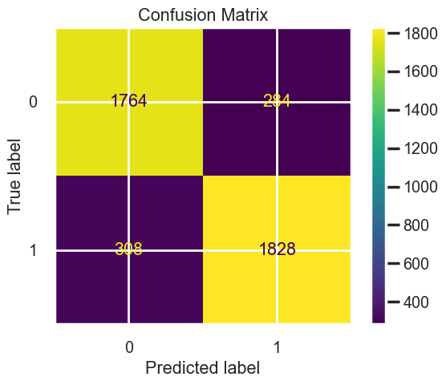

## Capstone

Business Understanding:
Since the beggining of time men have wagered on sport. Especially fighting, gladiator stuff. I have turned my hand to trying to predict UFC fights in which there is monetary gain to be made

# Stakeholders:
Other degenerate gamblers

# Data Source:
https://www.kaggle.com/code/miroslavkirnak/ufc-eda-and-prediction/data
Information about each fight in UFC history like strikes landed, and differentials. ​
Evenly balanced between wins and losses.
It is a dataset with a large amount of columns (530) and 13322 rows

# The Task:
Perform an analysis on fight metrics and create a machine learning model that can classify the result as binary win or loss. 

# Data Processing:
For the purpose of this project I am only concerned with wins and losses so Fights in which the results were Draws and no contests will be dropped.

A sklearn pipeline was used to pre-process the data.
Imputing with mean for numeric and most freq for cat data NANs.​
Scaled with standard scaler.

# Modeling:
The primary metric for assessing model performance was accuracy (classification of wins and losses).

The models I funneled the pipelines into were:
Logistic Regression​
Support Vector Machine​
Random Forrest

Gridsearch and PCA was also implemented in the subsequent model pipelines for hyperperameter tuning.

Feature importance was extracted from the highest performing model, though the models scored around the same.

# Evaluation
The best model as it turns out was the random forrest model without and hyperperameter tuning.

# Model Value & Limitations:
The random forrest model was overfit and attempts to change this by making the max_depth smaller didnt work either.  That said 86% isn't terrible.

# Recommendations & Next Steps:
Examine the top feature importances for the model in top p4p talent.